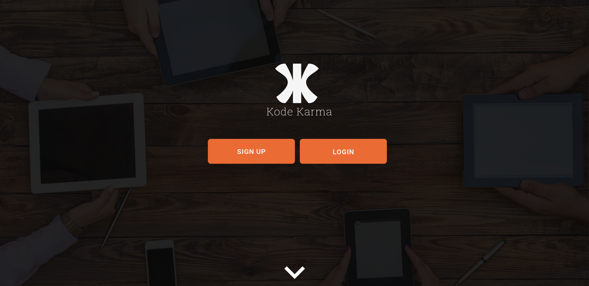

# Kode Karma

## Overview:
Kode Karma is a full stack Ruby on Rails application connecting digital talent with area non-profits.
It incorporates not only MVC, REST, and CRUD, but it also uses multiple table inheritance through polymorphism on the Devise User model.

[https://stormy-brook-26781.herokuapp.com/](https://stormy-brook-26781.herokuapp.com/)

## Project Notes:
I wanted to create this app because most non-profit organizations do not have access to quality resources for producing web and mobile content.
As a current coder, I want to aid our community through area non-profits, but as a coder it is difficult to identify organizations who need your skill set for a project.
As a former non-profit admin, I know first hand how difficult it is to find digital talent that wants to interface with a non-profit directly.

## Technologies Used:
+ HTML5, CSS3, Ruby, Rails 4, Postgresql, Devise Gem, Materialize Gem, Active Record
+ Design - Adobe Illustrator, wireframe.cc
+ Frameworks - Materialize Css
+ Project Planning & User Stories - [Trello](https://trello.com/b/b4sKX3VN/kode-karma)
+ Sublime Text 3

## Database ERM:

## PSD Mockup Homepage:

## Future Developments:
+ Additional functionalities for the Needs Board
+ Ability for users to message each other about postings
+ User profile images
+ Bug: Edit views for both Organization and Contributor to allow editing. Currently, user devise model is interferring.
+ Add additional security to new Organization and New Contributor forms. Currently, no validations on new sign up forms for these two user views.
+ Add password reset for users
