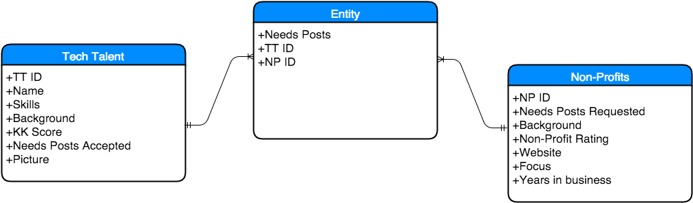

# Kode Karma
[https://stormy-brook-26781.herokuapp.com/](https://stormy-brook-26781.herokuapp.com/)

## Overview:
Kode Karma is a full stack Ruby on Rails application connecting digital talent with area non-profits.
It incorporates not only MVC, REST, and CRUD, but it also uses multiple table inheritance through polymorphism on the Devise User model.

## Project Notes:
As a current coder, I want to aid our community, but as a coder it is difficult to identify organizations in need of my particular skill set on a project by project basis.
As a non-profit admin, I know first hand how difficult it is to find digital talent to interface with an organization directly for a project.
I wanted to create this app because most non-profit organizations do not have access to quality resources for producing web and mobile content.
While they have excellent ideas and initiatives that benefit the collective whole, it is hard to get those messages out to our community without a solid digital presence.
Kode Karma was created to bridge this gap.

## Technologies Used:
+ HTML5, CSS3, Ruby, Rails 4, Postgresql, Devise Gem, Materialize Gem, Active Record
+ Design - Adobe Illustrator, wireframe.cc
+ Frameworks - Materialize Css
+ Project Planning & User Stories - [Trello](https://trello.com/b/b4sKX3VN/kode-karma)
+ Sublime Text 3

## Database ERM:

## PSD Mockup Homepage:

## Future Developments:
+ Additional functionalities for the Needs Board
+ Ability for users to message each other about postings
+ User profile images
+ Bug: Edit views for both Organization and Contributor to allow editing. Currently, user devise model is interferring.
+ Add additional security to new Organization and New Contributor forms. Currently, no validations on new sign up forms for these two user views.
+ Add password reset for users
